# Project Report - Internship

[[Datasets]](datasets.md)&nbsp;&nbsp;&nbsp;&nbsp;&nbsp;&nbsp;&nbsp;&nbsp;&nbsp;&nbsp;&nbsp;&nbsp;&nbsp;&nbsp;&nbsp;[[Codes]](codes.md)&nbsp;&nbsp;&nbsp;&nbsp;&nbsp;&nbsp;&nbsp;&nbsp;&nbsp;&nbsp;&nbsp;&nbsp;&nbsp;&nbsp;&nbsp;[[ToDo]]()

<Description>

## November

### Week 1 & 2

#### Two tracks for the project

1. Generating Face Depth Images from IR dot patterns image [Read More].
2. Face analysis from raw data [Read More].

 

- Retrained on binarized IR images
	
	**<pre>Non-binarized IR input		 		            Training loss</pre>**

	<pre>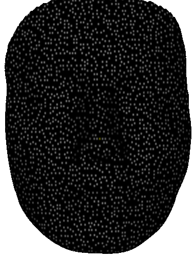		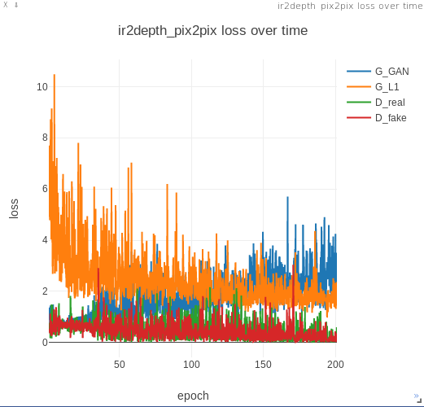</pre>

	[[Test output results (link)]](results/v1/index.html)

	**<pre>Binarized IR input		 		                 Training loss</pre>**

	<pre>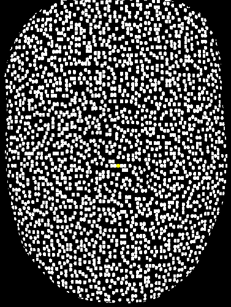		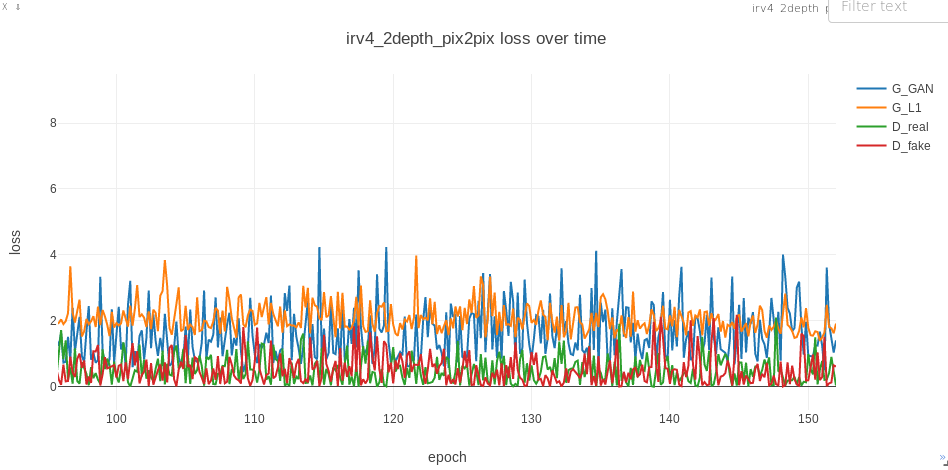</pre>

	[[Test output results (link)]](results/v3/index.html)

	**<pre>Trained on binarized IR images with varying distance from camera</pre>**

	<pre>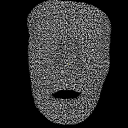 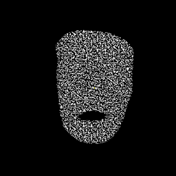 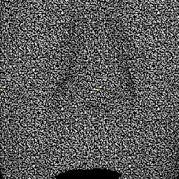</pre>

	[[Test output results (link)]](results/v2/index.html)

	**<pre>Tested on unseen pose and orientation </pre>**

	<pre>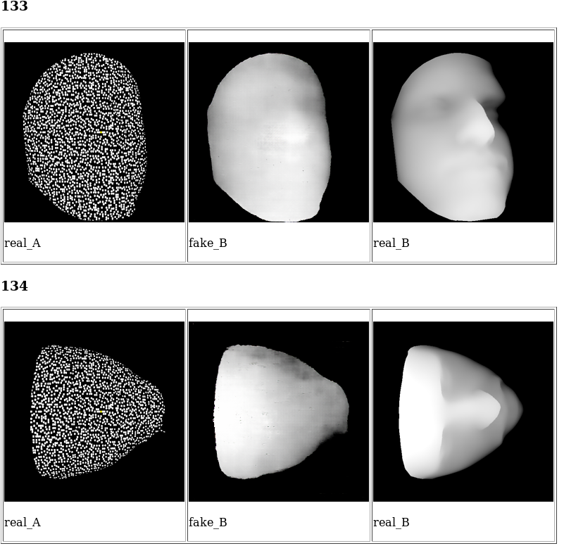</pre>

 

- Evaluation metrics

	- **RMSE**:&nbsp;&nbsp;&nbsp;&nbsp;&nbsp;&nbsp;&nbsp;&nbsp;&nbsp;&nbsp;&nbsp;&nbsp;&nbsp;&nbsp; 
	
	
	- **log10error**:&nbsp;&nbsp;&nbsp;&nbsp;&nbsp;&nbsp; 

	- **Structural similarity index (SSIM)** [[10]](#references): *While metrics such as MSE estimate absolute errors, SSIM is a perceptionbased metric that considers image degradation as perceived change in structural information, while also incorporating important perceptual phenomena, including both luminance masking and contrast masking terms. Structural information is the idea that the pixels have strong inter-dependencies especially when they are spatially close. These dependencies carry important information about the structure of the objects in a visual rendering of a scene. Using this metric, we retain the original 2D structure of the image (as opposed to using a vector notation) since SSIM is computed on windows of images.*[[9]](#references)

	| Ground Truth| Output|SSIM error|log10error|RMSE|
	| ------------- |:-------------:| -----:|-----:|-----:|
	|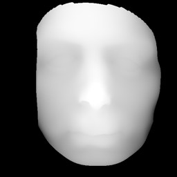|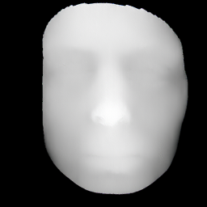|0.98   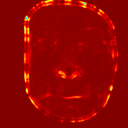|0.0174|9.0051|
	||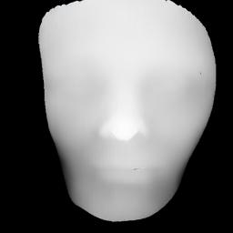|0.973   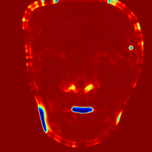|0.0205|9.5557|
	|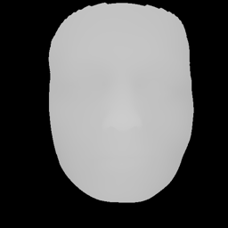|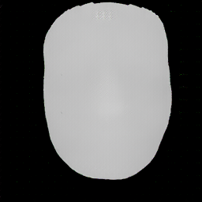|0.978   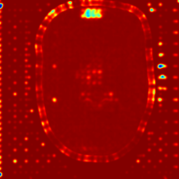|0.0103|5.1186|
	|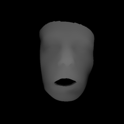|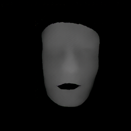|0.983   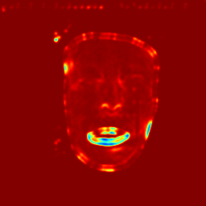|0.0122|3.9700|
	|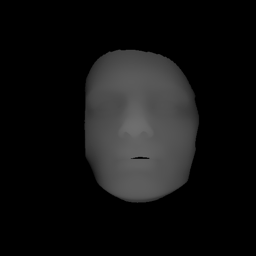|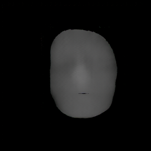|0.986   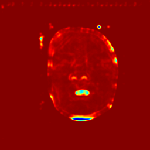|0.0100|3.0364|
	|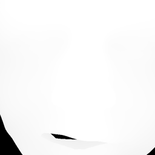|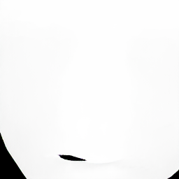|0.991   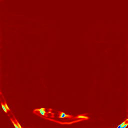|0.0043|5.7457|
	|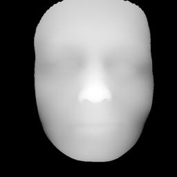||0.972   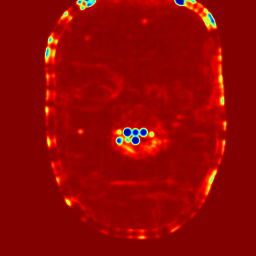|0.0152|8.3283|
	||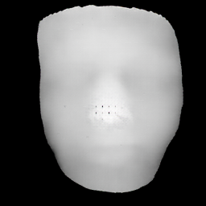|0.968   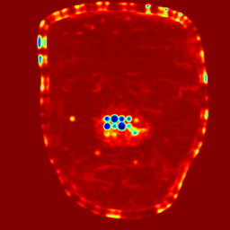|0.0181|9.3406|
	|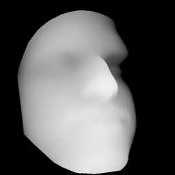|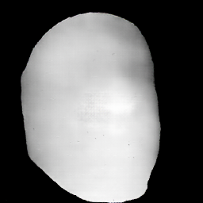|0.906   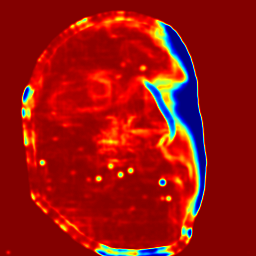|0.0856|30.3137|
	|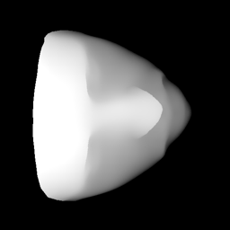|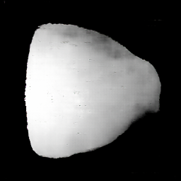|0.854   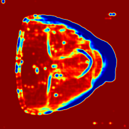|0.1186|30.8789|

	- **RANSAC**: *For a quantitative comparison, we used the first 200 subjects from the BU-3DFE dataset, which contains facial images aligned with ground truth depth images. Each method provides its own estimation for the depth image alongside a binary mask, representing the valid pixels to be taken into account in the evaluation. Obviously, since the problem of reconstructing depth from a single image is ill-posed, the estimation needs to be judged up to global scaling and transition along the depth axis. Thus, we compute these paramters using the Random Sample Concensus (RANSAC) approach, for normalizing the estimation according to the ground truth depth. This significantly reduces the absolute error of each method as the global parameter estimation is robust to outliers. The parameters of the RANSAC were identical for all the methods and samples.*[[2]](#references)
	
		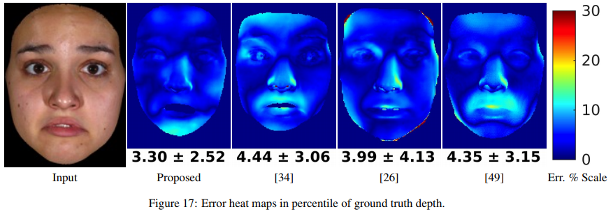

 

- "Unsupervised Adversarial Depth Estimation using Cycle Generative Networks"[[11]](#references)

	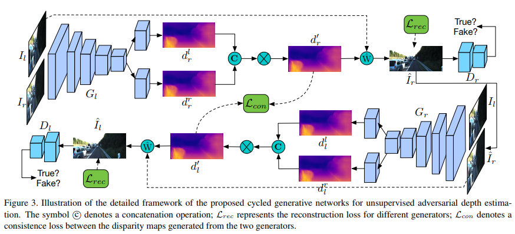

	**Evaluation Metrics (from the above paper)**: Given P the total number of pixels in the test set and  ,  the estimated depth and ground truth depth values for pixel i, we have:

	(i) the mean relative error (abs rel):  ,

	(ii) the squared relative error (sq rel):  ,

	(iii) the root mean squared error (rmse): ,

	(iv) the mean log 10 error (rmse log): 

	(v) the accuracy with threshold t, i.e.the percentage of  such that 

 

- "Structured Attention Guided Convolutional Neural Fields for Monocular Depth Estimation"[[13]](#references):

	*Recent works have shown the benefit of integrating Conditional Random Fields (CRFs) models into deep architectures for improving pixel-level prediction tasks. Following this line of research, in this paper we introduce a novel approach for monocular depth estimation. Similarly to previous works, our method employs a continuous CRF to fuse multi-scale information derived from different layers of a front-end Convolutional Neural Network (CNN). Differently from past works, our approach benefits from a structured attention model which automatically regulates the amount of information transferred between corresponding features at different scales. Importantly, the proposed attention model is seamlessly integrated into the CRF, allowing end-to-end training of the entire architecture.*

	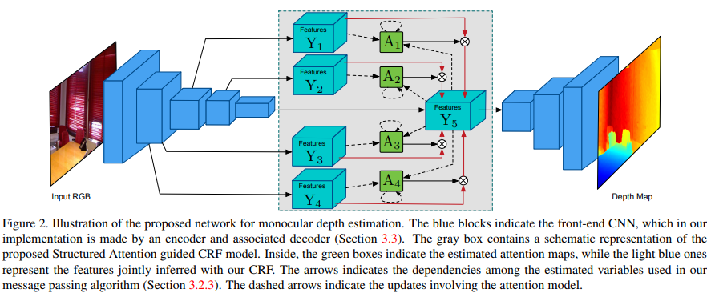

 

- Cascaded model refinement[[9]](#references):

	*Additional GANs can be further utilized to refine the outputs in a staged manner. Using the single RGB frame formulation as an example, a GAN is trained to map an RGB frame to a depth map. Next, we introduce a secondary GAN that maps the concatenation of the RGB frame and depth map estimate to a more refined depth map. In other words, the secondary GAN is trained on the concatenation of the inputs and the outputs from the primary GAN.*

	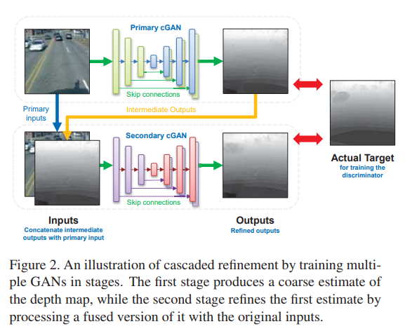

	*Issues: Paper does not demonstrate effectiveness of the above architecture*.

 

- "Learning to be a Depth Camera for Close-Range Human Capture and Interaction", Microsoft Research[[12]](#references):

	<pre>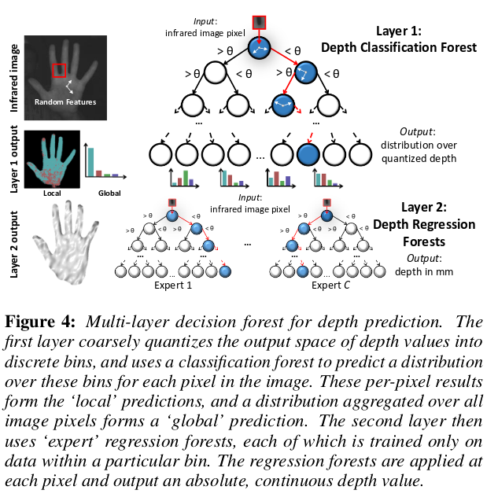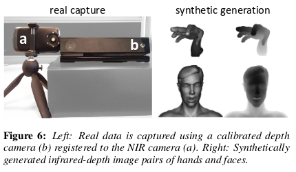</pre>

	*We present a machine learning technique for estimating absolute, per-pixel depth using any conventional monocular 2D camera, with minor hardware modifications.  Our approach targets close-range human capture and interaction where dense 3D estimation of hands and faces is desired. We use hybrid classification-regression forests to learn how to map from near infrared intensity images to absolute, metric  depth  in  real-time.   We  demonstrate  a  variety  of  human-computer interaction and capture scenarios. Experiments show an accuracy that outperforms a conventional light fall-off baseline, and is comparable to high-quality consumer depth cameras, but with a dramatically reduced cost, power consumption, and form-factor.*

 

- ActiveStereoNet: End-to-End Seld-supervised Learning for Active Stereo Systems

	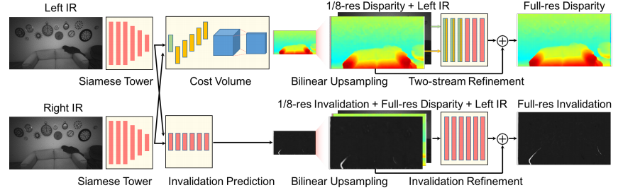

	- precise depth with subpixel precision of 1/30th of a pixel.
	- does not suffer from over-smoothing issues
	- preserves edges
	- handles occlusions
	- robust to noise and texture-less patches
	- invariant to illumination changes.
	- IR stereo camera pair is used, pseudorandom pattern projected, captures active illumination and passive light.

	- Avoid matching occluded pixels (causes oversmoothing, edge fattening)
	- New reconstruction loss based on LCN (local constrast normalization):
		- removes low frequency components from passive IR
		- re-calibrates the strength of active pattern locally to account for fading of patterns with distance.
	- Window-based loss aggregation with adaptive weights for each pixel
		- increase discriminability and reduce the effect of local minima in the stereo cost function.
	- Detect and omit occluded pixels in the images during loss computations.

	- Self-supervised vs supervised passive stereo:
		Read how self-supervised passive work.

	- Build-in stereo algorithms in cameras (Intel D400) uses a handcrafted binary descriptor (CENSUS) in combination with a semi-global matching scheme.
			- suffers from common stereo matching issues (edge fattening, quadratic error, occlusions, holes)

 

- Received two datasets [Read more](datasets.md).

- LS-Net?
- Fab-net and face metrics from IJB

# References

[2] [Unrestricted Facial Geometry Reconstruction Using Image-to-Image Translation, Sela et al.](https://arxiv.org/pdf/1703.10131.pdf)

[9] [Generative adversarial networks for depth map estimation from RGB video, Kin Gwn Lore et al.](http://openaccess.thecvf.com/content_cvpr_2018_workshops/papers/w21/Lore_Generative_Adversarial_Networks_CVPR_2018_paper.pdf)

[10] [Image Quality Assessment: From Error Visibility to Structural Similarity, Zhou Wang et al.](http://www.cns.nyu.edu/pub/lcv/wang03-preprint.pdf)

[11] [Unsupervised Adversarial Depth Estimation using Cycled Generative Networks, Andrea Pilzer et al.](https://arxiv.org/pdf/1807.10915.pdf)

[12] ["Learning to be a Depth Camera for Close-Range Human Capture and Interaction", Microsoft Research](http://delivery.acm.org/10.1145/2610000/2601223/a86-fanello.pdf?ip=138.96.200.116&id=2601223&acc=ACTIVE%20SERVICE&key=7EBF6E77E86B478F%2EC083A567C83E14C8%2E4D4702B0C3E38B35%2E4D4702B0C3E38B35&__acm__=1541768143_4cc7e69e959933f30c3480cf0ac37ef3)

[13] [Structured Attention Guided Convolutional Neural Fields for Monocular Depth Estimation, Dan Xu et al.](https://arxiv.org/pdf/1803.11029.pdf)